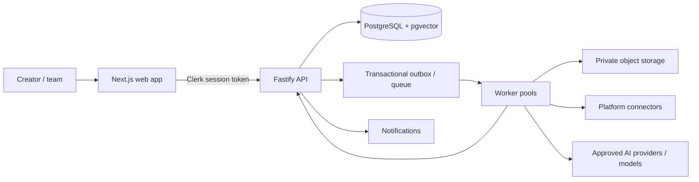

# Aegis AI

Aegis AI is an autonomous Trust & Safety platform that protects digital identity, reputation, content, communities, and businesses from online harm. Deepfake detection is one capability in a broader evidence-backed detection, response, and reporting system.

This repository is a production-oriented, architecture-first monorepo blueprint. It establishes system boundaries and operating standards before application business logic is built.

## Architecture at a glance



- `apps/web`: Next.js 15 and React 19 creator dashboard and public site.
- `apps/api`: Fastify API, authorization, domain commands/queries, and OpenAPI contract.
- `apps/worker`: asynchronous scanning, evidence capture, AI-agent orchestration, and delivery jobs.
- `packages/database`: Prisma schema, reviewed SQL migrations, and scoped data access.
- `packages/ui`: shared Tailwind CSS and shadcn/ui design system.
- `packages/contracts`: TypeScript API, event, and agent contracts shared across services.
- `packages/config`: shared TypeScript, ESLint, Tailwind, and environment-validation conventions.
- `infra`: Docker development stack and deployment-oriented infrastructure assets.

The detailed design is in the [architecture guide](docs/architecture.md), [service evolution plan](docs/microservices.md), [data model](docs/database.md), [API contract](docs/api.md), [security architecture](docs/security.md), and [delivery roadmap](docs/roadmap.md).

## Technology choices

| Concern                   | Choice                                                                |
| ------------------------- | --------------------------------------------------------------------- |
| Web                       | Next.js 15, React 19, TypeScript, Tailwind CSS, shadcn/ui             |
| API                       | Fastify, TypeScript, OpenAPI                                          |
| Identity                  | Clerk (users, organizations, session tokens)                          |
| Persistence               | PostgreSQL 16, Prisma, pgvector                                       |
| Async processing          | Redis, BullMQ, transactional outbox, dedicated worker pools           |
| AI                        | Provider-agnostic model gateway, OpenAI, Gemini, Claude adapters      |
| Local infrastructure      | Docker Compose with PostgreSQL/pgvector, Redis, and MinIO             |
| Production infrastructure | Cloudflare, AWS ECS/Fargate, S3, KMS/Secrets Manager, Neon PostgreSQL |
| Monorepo                  | pnpm workspaces and Turborepo                                         |
| CI/CD                     | GitHub Actions, OIDC, signed images, SBOM/provenance                  |

## Repository layout

```text
apps/
  web/                 Next.js application
  api/                 Fastify HTTP API and authorization boundary
  worker/              asynchronous jobs and agent orchestration
packages/
  ai-contracts/        agent inputs, outputs, and policy contracts
  contracts/           API DTOs, event envelopes, and shared domain types
  database/            Prisma schema, migrations, scoped database client
  ui/                  shared shadcn/ui components and Tailwind theme
  config/              lint, TypeScript, Tailwind, environment conventions
infra/
  docker/              local Docker configuration
docs/                  architecture, security, APIs, data, quality, operations
.github/workflows/     CI and security automation
```

## Getting started (when implementation begins)

1. Install Node.js 22 LTS, pnpm 9+, and Docker Desktop.
2. Copy `.env.example` to `.env` and supply development-only credentials.
3. Start local infrastructure with `docker compose up -d postgres redis minio`.
4. Install dependencies with `pnpm install`.
5. Apply database migrations with `pnpm --filter @aegis/database prisma:migrate`.
6. Run all services with `pnpm dev`.

These are Phase 1 operational targets. Package manifests and feature code are intentionally deferred in this documentation-first foundation.

## Engineering principles

- Protect creator data by default: workspace isolation, encrypted secrets, signed object access, audit trails, and least-privilege roles.
- Keep the request path deterministic; crawling, media analysis, AI inference, evidence capture, and notifications are asynchronous jobs.
- Treat AI output as evidence-backed recommendations, never as an unreviewed enforcement decision.
- Preserve provenance: raw evidence is immutable, findings are versioned, and agent/model metadata is retained for every conclusion.
- Make integrations replaceable through connector and provider interfaces rather than embedding platform-specific logic in domain services.

## Status

Architecture and repository scaffold are complete. Feature implementation begins with the foundations in Phase 1 of the roadmap. The design intentionally starts as a modular monolith, with explicit extraction criteria for dedicated services.

## Documentation index

- [System architecture](docs/architecture.md)
- [Microservice evolution plan](docs/microservices.md)
- [Database schema and data lifecycle](docs/database.md)
- [HTTP API and event contracts](docs/api.md)
- [AI-agent architecture and safeguards](docs/ai-agents.md)
- [Security and privacy architecture](docs/security.md)
- [Roles, permissions, and approval controls](docs/permissions.md)
- [Dashboard information architecture and wireframes](docs/dashboard-wireframes.md)
- [Deployment architecture](docs/deployment.md)
- [Developer guide](docs/developer-guide.md)
- [Coding standards](docs/coding-standards.md)
- [Testing strategy](docs/testing-strategy.md)
- [CI/CD strategy](docs/cicd.md)
- [Observability, SLOs, and operational readiness](docs/operations.md)
- [Phased development roadmap](docs/roadmap.md)
- [Architecture decision record: service boundaries](docs/adr/0001-monorepo-and-service-boundaries.md)
- [Local-development and incident runbooks](docs/runbooks/README.md)

## License

Proprietary — all rights reserved.
