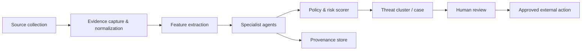

# AI Agent Architecture

## Design stance

AI is a constrained analysis pipeline, not an autonomous actor. Agents produce typed, evidence-linked findings; a deterministic policy engine aggregates them; humans approve external enforcement. Each agent records confidence, evidence references, provider/model/version, input fingerprint, cost, and failure reason.

## Pipeline



## Agent roles

| Agent | Inputs | Outputs | Guardrails |
| --- | --- | --- | --- |
| `DiscoveryAgent` | monitoring rule, platform results | normalized candidates, coverage | approved connectors/rate limits; no classification. |
| `EvidenceAgent` | source URL/metadata | artifacts, hashes, capture manifest | SSRF, malware, MIME/size controls; no authenticated browsing. |
| `IdentityMatchAgent` | approved identity refs, candidate assets | account/handle/likeness similarity | score is not identity proof; calibrated biometric handling. |
| `SyntheticMediaAgent` | image/video/audio derivatives | deepfake/manipulation indicators | report uncertainty; never label a person deceptive. |
| `ContentSimilarityAgent` | reference fingerprints, candidate media/text | hash/embedding match results | distinguish exact, transformed, semantic matches. |
| `AbuseRiskAgent` | text/context/policy | harassment, doxxing, scam signals | redact sensitive logs; separate speech from actionable policy. |
| `CaseSynthesisAgent` | findings/case history | cited case summary/recommendation | retrieval limited to workspace/case; no action authority. |
| `ResponseDraftAgent` | approved case, platform rules | draft report/takedown/appeal | draft only; reviewer approval mandatory. |

## Agent contract

All agents use a common package contract:

```ts
type AgentRunInput = {
  runId: string;
  workspaceId: string;
  caseId?: string;
  sourceItemIds: string[];
  evidenceIds: string[];
  policyVersion: string;
  traceId: string;
};

type AgentFinding = {
  findingType: string;
  verdict: "POSITIVE" | "NEGATIVE" | "INCONCLUSIVE";
  confidence: number;
  evidenceIds: string[];
  rationale: string;
  limitations: string[];
  model: { provider: string; name: string; version: string };
};
```

The orchestrator validates schema conformance, verifies evidence belongs to the workspace, records provenance, and rejects output that is invalid, ungrounded, out of policy, or beyond cost/time budget.

## Orchestration model

1. A domain event requests analysis for a normalized source item.
2. The orchestrator selects a graph based on modality, monitoring rule, legal/policy constraints, and available reference assets.
3. Specialist jobs run in parallel where possible, subject to provider rate and spend limits.
4. A deterministic policy engine combines calibrated scores, thresholds, source reputation, and corroborating evidence, returning a transparent risk breakdown—not free-form model judgment.
5. A clusterer relates detections by URLs/accounts, hashes, embeddings, and reviewed links.
6. Changed risk triggers notification/review; only a human-approved workflow permits enforcement submission.

## Safety, quality, and governance

- Maintain an approved model registry: owner, purpose, modalities, version, data classification, regions, cost cap, retirement date.
- Never train on creator data or send it to a provider without explicit documented consent. Prefer zero-retention/vendor regional settings.
- Encrypt/tokenise biometric and highly sensitive features; raw media access is narrower than detection access.
- Version prompts, tools, policies, settings, thresholds, and reference asset sets. Store content fingerprints rather than sensitive inputs in logs.
- Calibrate against diverse/adversarial datasets; track precision, recall, calibration error, override rate, and lawful disparate-impact indicators.
- Hard-stop on insufficient/conflicting evidence, policy block, provider outage, budget exhaustion, or low confidence. Return `INCONCLUSIVE`, never forced classification.
- Agents never publish, report, remove content, or contact third parties directly.

## Provider abstraction and release gate

`Agent → ModelGateway → ProviderAdapter → External provider` keeps provider SDKs out of domain modules. The gateway handles routing, timeout/retry, PII redaction, content policy, spend tracking, and structured-output validation.

Every agent/model release requires schema tests, threat-model review, benchmark threshold, false-positive review, cost/latency measurement, rollback plan, and feature-flagged rollout. Start with shadow or review-only analysis.
