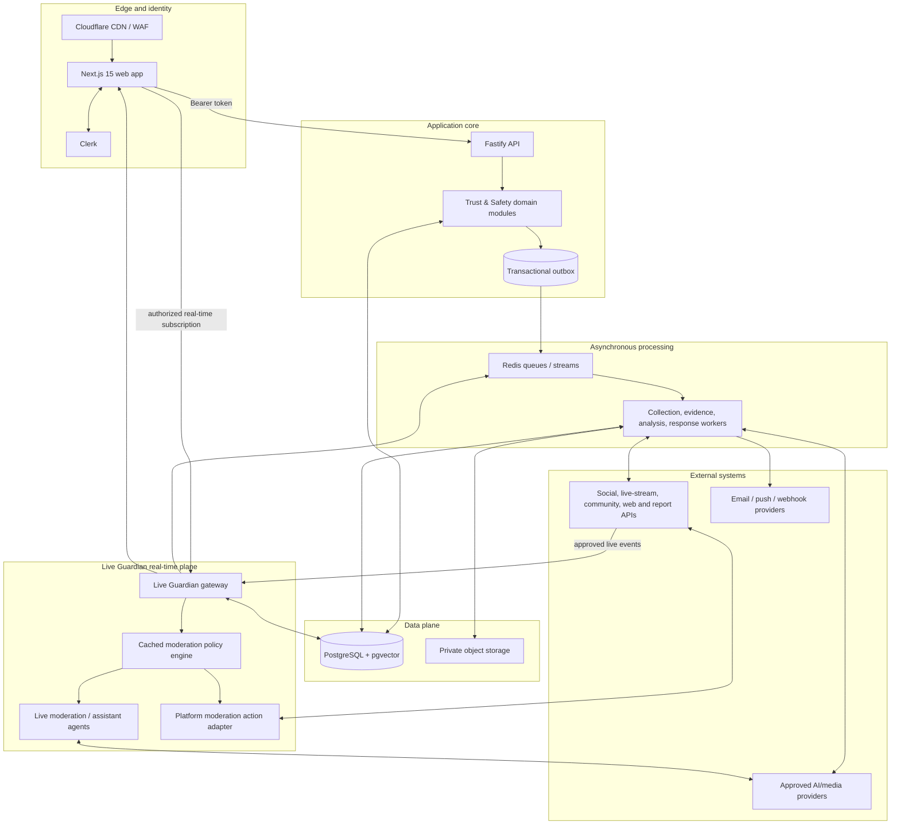

# Aegis AI System Architecture

## Purpose and platform scope

Aegis AI is an AI Trust & Safety operating system for creators, livestreamers, agencies, brands, and communities. It helps teams discover potential harm, preserve evidence, assess risk, coordinate a response, and maintain an auditable record.

The platform protects gamers, YouTubers, Twitch/Kick streamers, Instagram/TikTok Live creators, lifestyle, technology, education, finance, and music creators, podcasters, agencies, brands, and their communities. It must safely process untrusted web content, sensitive identity/media data, and high-volume live-chat events while maintaining strict workspace isolation.

Core platform capabilities are Identity Protection, Reputation Protection, Content Protection, Threat Intelligence, Evidence Center, AI Crisis Management, Community Safety, and **Live Guardian**.

## Logical components

## Workload boundaries

The first production deployment remains a modular monolith for core business workflows, with four independently deployed workloads:

| Unit                    | Owns                                                                                                     | May depend on                                     |
| ----------------------- | -------------------------------------------------------------------------------------------------------- | ------------------------------------------------- |
| `apps/web`              | creator, analyst, and moderator experience; real-time presentation                                       | `ui`, `contracts`, `config`                       |
| `apps/api`              | HTTP boundary, authorization, domain commands/queries, OpenAPI                                           | `contracts`, `database`, `ai-contracts`, `config` |
| `apps/worker`           | scans, evidence capture, crawling, async agents, reporting/delivery jobs                                 | `contracts`, `database`, `ai-contracts`, `config` |
| `apps/live-guardian`    | normalized live-event ingestion, low-latency policy evaluation, moderator presence, real-time UI fan-out | `contracts`, `database`, `ai-contracts`, `config` |
| `packages/database`     | Prisma schema, migrations, database access convention                                                    | `config`                                          |
| `packages/contracts`    | versioned DTOs, events, errors, moderation action schemas                                                | no application package                            |
| `packages/ai-contracts` | agent I/O, evidence/provenance, moderation policy-gate contracts                                         | `contracts`                                       |
| `packages/ui`           | design tokens and presentational primitives                                                              | `config`                                          |

Apps never import another app. `apps/web` never accesses PostgreSQL directly. The Live Guardian gateway has a separate deployment and scaling profile because a slow capture, model, or queue must not block a live-chat moderation decision.

## Live Guardian design

Live Guardian is a first-class Community Safety module, not a batch scan. It supports authorized YouTube Live, Twitch, Kick, TikTok Live, Instagram Live, and Discord integrations as platform capabilities and approved APIs permit.

### Real-time moderation path

1. A platform adapter receives an authorized live-session and chat event, verifies signature/origin where available, deduplicates it, and normalizes it into a `LiveChatMessage` contract.
2. The Live Guardian gateway resolves the active workspace, channel, moderator assignments, platform capabilities, and a versioned cached moderation policy.
3. A deterministic fast path evaluates keywords, allow/block lists, rate limits, URL/scam indicators, repeat-offender and raid/bot signals. It produces an auditable policy decision within the live latency budget.
4. Specialist moderation/assistant models enrich eligible events with structured toxicity, hate, threat, child-safety, NSFW, self-harm, sentiment, or conversation-de-escalation findings. Time-bounded model calls may only augment the fast path; a provider delay cannot stop ingestion.
5. A policy gate selects `suggest`, `warn`, `reply`, `delete`, `timeout`, `mute`, `shadow mute`, `ban`, `slow mode`, or `notify moderator` only if that action is explicitly enabled, threshold-qualified, and supported by the connector.
6. The action adapter uses a provider idempotency key, records the outcome, and streams an explained action/finding to the moderator console. Unsupported capabilities become a recommendation, never a fake successful action.
7. Incidents, selected evidence, and community-health snapshots flow through the durable outbox for case management, reporting, and analytics.

Normal target: deterministic policy decision p95 under 150 ms after normalized event receipt, subject to platform delivery latency. AI enrichment is an explicitly measured best-effort budget, not a hidden synchronous dependency.

### Human-like moderator assistance

The assistant may propose or, if policy authorizes, send bounded respectful replies and warnings. It must explain the applicable rule, calm rather than inflame discussion, avoid impersonating the creator, not make legal/medical claims, and cite the moderation reason in the operator view. High-severity threats, child-safety, or self-harm signals always notify a human according to policy; the assistant never provides emergency advice beyond approved escalation messaging.

### Moderation versus external enforcement

Live moderation actions are controlled actions within an account the workspace has authorized Aegis to moderate. They may be automated only under an explicit workspace policy, channel assignment, threshold, rate limit, and connector capability. They are distinct from external takedowns, legal reports, public statements, or law-enforcement referrals, which continue to require human approval under ADR 0002.

## Request and job flows

### Interactive request

1. Clerk authenticates the user in the web app.
2. The web app sends a Clerk-issued token to Fastify; the real-time UI obtains a separate short-lived subscription token with channel scope.
3. Middleware validates token claims, resolves local user, active workspace, role, and—on live routes—channel assignment.
4. A domain module performs one transaction. Long-running work is inserted into `outbox_events` in that same transaction.
5. Fastify returns a typed resource or accepted-job response; it never waits for collection or model inference.

### Detection, review, and evidence

1. A scheduled or manual scan creates a `scan_runs` record and queues work.
2. A connector collects policy-allowed metadata/media references and creates immutable source/evidence records.
3. Specialist agents emit structured, evidence-linked findings. A deterministic policy gate creates or updates a detection/threat cluster.
4. The system calculates transparent risk, creates a case when thresholds are met, and notifies the workspace.
5. A human reviews recommended external action before any report or takedown.

## Security and privacy design

- **Tenant isolation:** Every tenant-owned table has `workspace_id`; repositories require it and production PostgreSQL uses RLS. Live session, message, action, and appeal reads additionally require authorized channel scope.
- **Live-event integrity:** Verify provider signatures/origins where supported, reject duplicates/replays, use platform connection-scoped credentials, and retain an event hash/timestamp/audit outcome for material actions.
- **Sensitive chat data:** Store encrypted message/author fields only for the configured minimum duration. Persist selected evidence or legally held material through the Evidence Center, not broad permanent chat archives.
- **Secrets and media:** Connector tokens live in a secret manager; evidence uses randomized private object keys, short-lived signed URLs, SHA-256, lineage, retention, and legal holds.
- **Untrusted content:** Browser/content collection runs in isolated workers with egress controls, size/MIME limits, malware scanning, and SSRF defenses.
- **AI safety:** Moderation outputs are typed, evidence-linked, policy-gated, versioned, spend-bounded, and retained with limitations. Agent output does not bypass connector capability or human escalation controls.

## Reliability and scalability

- Core commands use PostgreSQL transactions plus a transactional outbox; queues are at-least-once with idempotent handlers, retry/backoff, and dead-letter workflow.
- Live Guardian uses a separate connection/event-processing pool, partitioned by channel/session, with bounded in-memory policy caches and durable write-behind. It must degrade to deterministic policy and human notification rather than drop all moderation during model/provider failure.
- Chat storage is partitioned by time/session and has a short default retention. High-volume message analytics are derived asynchronously and never make the moderation gateway query a warehouse.
- Scale API, collector, media-analysis, Live Guardian, and notification workloads independently; cap per-platform concurrency and model spend.
- Instrument all paths with OpenTelemetry, structured redacted logs, queue age, moderation decision latency, action success/reversal, model confidence/override, and community-health metrics.

## Production topology and targets

The production shape is documented in [deployment architecture](deployment.md). Initial targets include dashboard/API availability of 99.9% monthly, p95 read API under 300 ms, evidence integrity manifests for 100% of retained artifacts, and zero duplicate external or live moderation actions. Live-specific SLOs and alerts are in [operations](operations.md).

## Evolution path

Start with shared domain contracts, a shared PostgreSQL source of truth, and independently deployed workloads. Extract a dedicated service only when scaling, security boundary, data ownership, or deployment cadence warrants it. Live Guardian is already separated as a runtime workload because its low-latency/event-connection profile is materially different; it remains contractually integrated with the core case, evidence, audit, and analytics modules.
