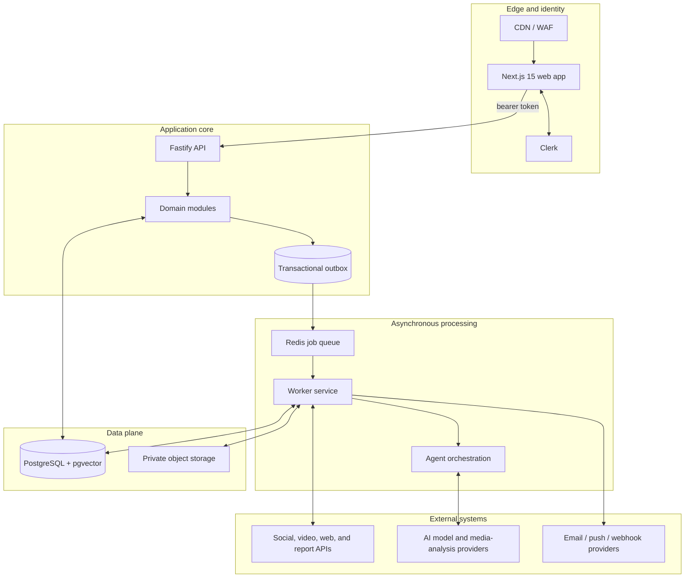

# Aegis AI System Architecture

## Purpose and scope

Aegis AI helps a creator or creator-management team discover potential abuse, preserve evidence, assess risk, coordinate response, and keep an auditable record. It must safely process untrusted web content and sensitive identity/media data while maintaining strict workspace isolation.

The first production deployment should be a modular monolith: a Next.js application, Fastify API, and worker deployment backed by PostgreSQL, Redis, and object storage. Modules communicate through typed contracts and an outbox so they can later be separated without a domain-model rewrite.

## Logical components

## Monorepo boundaries

| Unit | Owns | May depend on |
| --- | --- | --- |
| `apps/web` | UI, routes, server-side presentation, Clerk client integration | `ui`, `contracts`, `config` |
| `apps/api` | HTTP boundary, authorization, domain commands/queries, OpenAPI | `contracts`, `database`, `ai-contracts`, `config` |
| `apps/worker` | job consumers, crawling adapters, evidence pipeline, agent runs | `contracts`, `database`, `ai-contracts`, `config` |
| `packages/database` | Prisma schema, migrations, repositories/database client | `config` |
| `packages/contracts` | versioned DTOs, events, error vocabulary | no application package |
| `packages/ai-contracts` | agent inputs/outputs, provenance and approval policies | `contracts` |
| `packages/ui` | design tokens and shadcn/ui primitives | `config` |

Apps must never import another app. The web app never accesses the database directly; it uses the Fastify API or explicitly designed backend-for-frontend routes. Only the API and worker own database access.

## Request and job flows

### Interactive request

1. Clerk authenticates the user in the web app.
2. The web app sends a Clerk-issued token to Fastify.
3. Middleware validates token signature, issuer, audience, and expiration, then resolves the local user and active workspace.
4. A domain module performs one transaction. Resulting asynchronous work is inserted in `outbox_events` in that same transaction.
5. Fastify returns a typed resource or accepted-job response; it never waits for crawling or AI inference.

### Detection and review

1. A scheduled or manual scan creates a `scan_runs` record and queues work.
2. A connector collects policy-allowed metadata/media references and creates immutable source/evidence records.
3. The worker stores artifacts in private object storage, hashes them, and submits derivatives to media services.
4. Specialist agents emit structured, evidence-linked findings. A policy gate creates or updates a detection/threat cluster.
5. The system calculates a transparent risk score, creates a case when thresholds are met, and notifies the workspace.
6. A human reviews recommended action before any external report or takedown, unless a later explicitly approved policy changes this.

## Security and privacy design

- **Tenant isolation:** Every tenant-owned table carries `workspace_id`. Repository methods must require it; production PostgreSQL uses row-level security. API authorization checks Clerk organization membership plus application role.
- **Identity:** Clerk owns credentials, sessions, MFA, and organization membership. Local users map `clerk_user_id`; `workspaces.clerk_organization_id` maps team workspaces.
- **Secrets:** Connector tokens and vendor keys never enter PostgreSQL plaintext. Store secret-manager references or KMS-enveloped ciphertext; redact logs.
- **Media/evidence:** Use a private bucket with randomized keys and short-lived signed URLs. Track SHA-256, chain-of-custody events, derivative relation, retention date, and legal hold.
- **Untrusted content:** Fetch in isolated workers with egress controls, size/MIME limits, malware scanning, SSRF protection, and no browser session cookies.
- **Auditability:** Append-only audit records include actor, workspace, correlation ID, and redacted change summary. AI runs preserve model/provider/version, input fingerprint, output references, cost, and reviewer decision.
- **Data minimization:** Collect only case-relevant material, classify PII, support retention/deletion workflows, and apply legal holds before purge.

## Reliability and scalability

- PostgreSQL transactions plus transactional outbox; publisher dispatches idempotently to a Redis-backed queue.
- Jobs use idempotency keys, retries with exponential backoff, dead-letter handling, per-platform rate limits, and durable `job_runs` records.
- All external side effects use provider idempotency keys and retain request/response references.
- Keep API nodes low-latency and separate from CPU/GPU-heavy workers. Scale workers per queue, workload class, and provider quota.
- Add structured JSON logging, OpenTelemetry, SLO metrics, alerting, PostgreSQL PITR backups, and object-storage versioning/restore testing.

## Production topology

| Layer | Initial production shape |
| --- | --- |
| Web | Stateless Next.js containers behind CDN/WAF |
| API | Stateless Fastify containers behind internal load balancer |
| Workers | Separate pools for collection, media analysis, notifications; restricted egress |
| Database | Managed PostgreSQL 16 with HA, PITR, pgvector, encryption, RLS, pooler |
| Queue/cache | Managed Redis with TLS, persistence, queue/rate-limit namespaces |
| Files | Private versioned object storage with lifecycle policy and KMS encryption |
| Secrets | Cloud secret manager with workload identity |
| Observability | OpenTelemetry collector, error tracking, centralized logs, metrics, dashboards |

## Initial non-functional targets

| Area | Target |
| --- | --- |
| Dashboard/API availability | 99.9% monthly |
| Read API latency | p95 under 300 ms excluding third-party calls |
| Command acknowledgement | p95 under 500 ms; long work is `202 Accepted` |
| Evidence integrity | 100% have SHA-256 and provenance metadata |
| Job delivery | at-least-once delivery with idempotent handlers |
| Recovery | database RPO ≤ 15 minutes; RTO ≤ 4 hours (validate with owners) |

## Evolution path

Begin with this modular monolith. Extract a service only when data ownership, scaling, security boundary, or deployment cadence warrants it. Likely first candidates are crawler/media processing and notification delivery.
