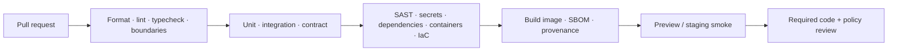

# CI/CD Strategy

## Principles

Build once, verify the same immutable artifact, and promote by digest. CI credentials are least privilege and short lived through GitHub OIDC; no cloud access key or production secret is stored in repository configuration. A deployment is a traceable change set: commit, dependency lock, SBOM, image digest, infrastructure plan, migration version, test evidence, approver, and rollback reference.

## Pull request pipeline

| Stage | Required checks |
| --- | --- |
| Validate | formatting, lint, strict typecheck, dependency graph/boundary rules, generated contract consistency. |
| Test | unit/component tests, disposable integration stack, API/event contract compatibility, focused browser tests. |
| Secure | secret detection, CodeQL/SAST, dependency/license scan, container scan, IaC scan, unsafe log pattern checks. |
| Build | reproducible production image, SBOM, provenance/attestation, image signing, no mutable tag as release identity. |
| Preview | deploy eligible changes with sanitized config, run smoke/accessibility/critical-flow tests, destroy after review. |

Protected `main` requires successful checks, review, code-owner approval for sensitive paths, and no unresolved security exceptions. Dependabot/Renovate-style upgrades are grouped, tested, and expedited for critical fixes.

## Promotion pipeline

1. Merge to `main` creates a candidate with artifact digest and release notes.
2. Deploy the exact candidate to staging; run migration compatibility, integration/provider sandbox, smoke, performance smoke, and selected evaluation gates.
3. A release approval validates the risk level, migration plan, feature flags, monitoring dashboard, alert readiness, and rollback owner.
4. Deploy production progressively (canary or blue/green). Automated health checks observe HTTP errors, p95 latency, queue age, job failures, provider errors, cost, and security signals.
5. Promote/expand only within thresholds. On breach, halt and roll back the image or disable the feature/model route. Record the outcome in the release log.

## Database delivery

Database changes are independently reviewed artifacts. The CI pipeline applies migrations to an ephemeral database and staging before production. Production releases use expand–migrate–contract and backwards-compatible application reads/writes. A schema change that could block, purge, or expose tenant data has a maintenance plan, tested recovery, and explicit approval.

## GitHub workflow baseline

The repository currently includes documentation-scaffold and CodeQL workflows. When Phase 1 package manifests and lockfile are added, enable the quality job in `.github/workflows/ci.yml` and add the following required jobs:

- `pnpm install --frozen-lockfile`, format, lint, typecheck, test, build;
- PostgreSQL/Redis/MinIO service integration tests;
- OpenAPI/event compatibility and schema-generation drift check;
- secret, dependency, license, container, and IaC scans;
- image build, SBOM/provenance generation, signing, and registry push;
- OIDC-based staging/production deployment with environment protection rules.

CI must pin action versions by commit digest in the hardened production workflow, set minimal `permissions`, restrict third-party actions, and publish artifacts with finite retention. Scheduled jobs rerun dependency/security scans, restore tests, and a representative connector/model health check.

## Rollback and change control

Application rollback means redeploying a prior signed image digest. Configuration/flag rollback is immediate and audited. Data migrations are not blindly reversed: use forward remediation or restore procedures according to the migration plan. High-risk changes—including authorization, evidence lifecycle, model routing, enforcement, or infrastructure network policy—require a change record, peer review, release owner, and runbook link.
