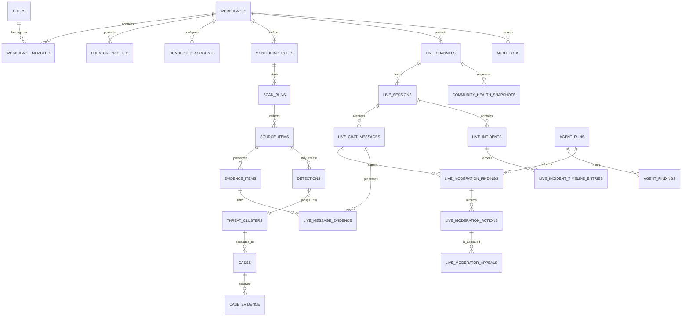

# Database Schema and Data Lifecycle

## Conventions

- PostgreSQL 16 is the source of truth. Prisma manages the relational model; migrations are reviewed SQL artifacts.
- IDs are UUIDs generated by PostgreSQL. Timestamps use UTC `timestamptz`.
- Every tenant-owned table carries `workspace_id`. Production RLS uses a transaction-local workspace claim; association triggers ensure linked records share that workspace.
- Evidence provenance and audit records are append-only. Mutable reviewed workflows use a `version` field where collisions matter.
- Large media, raw platform payloads, and legal/export artifacts live in private object storage; PostgreSQL stores identifiers, hashes, manifests, status, and redacted summaries.
- Live-chat tables are high-volume data: partition by time/session in reviewed SQL, use short configured retention, and retain encrypted raw content only where policy, evidence, appeal, or legal hold requires it.

The authoritative model is [packages/database/prisma/schema.prisma](../packages/database/prisma/schema.prisma).

## Entity map

## Core protection tables

| Table | Key columns | Responsibility |
| --- | --- | --- |
| `users`, `workspaces`, `workspace_members` | Clerk identifiers, `workspace_id`, role, status | Application identity mapping and workspace boundary; no passwords. |
| `creator_profiles`, `identity_references` | protected profile, encrypted/hash identity reference | Creator/brand identity, aliases, domains, reference assets. |
| `connected_accounts` | platform account ID, secret reference, scopes, state | Authorized platform connection; secret value stays in secret manager. |
| `monitoring_rules`, `scan_runs` | type, schedule, config, idempotency/status | Bounded background monitoring. |
| `source_items`, `evidence_items` | source reference, object key, SHA-256, hold/retention | Normalized content discovery and immutable evidence chain. |
| `detections`, `threat_clusters`, `cases` | category, risk, review/case state | Evidence-backed asynchronous Trust & Safety workflow. |
| `enforcement_actions` | draft, approval, provider state, idempotency | Human-approved external reports and response actions. |
| `agent_runs`, `agent_findings` | provider/model/policy, fingerprint, verdict | Reproducible agent analysis and reviewer outcome. |
| `content_embeddings` | model/version, `vector`, access scope | Semantic/content matching; pgvector index added by SQL migration. |
| `outbox_events`, `job_runs`, `notification_deliveries`, `audit_logs` | event/job/delivery/audit metadata | Reliability, traceability, and security operations. |

## Live Guardian tables

| Table | Key columns | Responsibility |
| --- | --- | --- |
| `live_channels` | workspace, creator/account, platform channel, capabilities | A protected channel/community and connector-supported moderation capabilities. |
| `live_moderator_assignments` | workspace, channel, user, moderator role | Channel-scoped lead/moderator/observer assignment. |
| `live_moderation_policies` | workspace/channel, version, config, state | Versioned keyword, threshold, automation, escalation, language, and retention policy. |
| `live_sessions` | channel, external session ID, live state/times | One stream/event lifecycle. |
| `live_chat_messages` | session, platform message ID, encrypted content, author hash, expiry | High-volume normalized chat event record; short-lived by default. |
| `live_moderation_findings` | session/message, category, severity, confidence, policy version | Typed toxicity, hate, scam, bot, raid, threat, child-safety, NSFW, self-harm, and sentiment signals. |
| `live_moderation_actions` | finding/message, action type/source/status, provider reference | Proposed, human-issued, or policy-authorized warn/reply/delete/timeout/mute/ban/slow-mode action. |
| `live_moderator_appeals` | action, appellant hash, encrypted reason, reviewer outcome | Auditable review and reversal path for moderated users. |
| `live_incidents`, `live_incident_timeline_entries` | session, severity/state, ordered timeline | Raid/abuse/crisis grouping and live incident timeline. |
| `community_health_snapshots` | channel/session, score, sentiment, metric window | Time-series community-health and sentiment outcomes. |
| `live_message_evidence` | message/evidence link, purpose | Promotes material live messages/artifacts into the Evidence Center without retaining all chat forever. |

## Live Guardian data lifecycle

1. The gateway writes a normalized event with a dedupe key, encrypted content where needed, author hash, policy version, and expiry. It does not store platform tokens or unbounded raw payloads.
2. The deterministic and AI moderation pipeline adds findings/actions with trace and policy provenance. Action outcomes are never overwritten; reversals are new state/audit events.
3. Material messages, incident captures, or appeal-related content are captured as `EvidenceItem`s with a hash and manifest, then linked through `live_message_evidence`.
4. The retention worker deletes expired non-evidentiary message content after validating no legal hold, active appeal, incident preservation rule, or case/evidence link. It writes an audit record/tombstone.
5. Aggregated Community Health snapshots remain available for reporting without needing raw chat text.

## Enum vocabulary

| Enum | Values / intent |
| --- | --- |
| `WorkspaceRole` | `OWNER`, `ADMIN`, `ANALYST`, `MODERATOR`, `REVIEWER`, `VIEWER`. |
| `Platform` | Core social/community sources including `YOUTUBE`, `TWITCH`, `KICK`, `INSTAGRAM`, `TIKTOK`, and `DISCORD`. |
| `LiveModerationCategory` | toxicity, hate speech, spam, scam link, bot activity, raid, harassment, threat, child safety, NSFW, self-harm, keyword, sentiment, other. |
| `LiveModerationActionType` | warn, reply, delete message, timeout, mute, shadow mute, ban, enable/update slow mode, notify moderator. |
| `LiveModerationActionSource` | policy automation, AI assistant, human moderator. |
| `LiveModerationActionStatus` | suggested, pending approval, queued, applied, failed, cancelled, reversed. |
| `LiveAppealStatus` | open, in review, accepted, rejected, closed. |
| `LiveIncidentStatus` | open, acknowledged, mitigating, resolved, dismissed. |

## Prisma and PostgreSQL notes

Use reviewed SQL migrations for `pgcrypto`, `vector`, RLS, partial unique indexes, vector indexes, live-message partitioning, immutable audit triggers, retention purges, and same-workspace association triggers; Prisma cannot fully express each PostgreSQL feature.

Important indexes include tenant/time indexes for every live table; `(live_session_id, platform_message_id)` for deduplication; queue/review indexes for active findings/actions/appeals; and partial indexes for live sessions and open incidents. Retention jobs must be index-friendly and bounded to avoid locking active chat tables.

## Retention and deletion policy

Evidence expires only when not on a case or legal hold. Live chat has a configurable short retention default; evidence, active appeals, and incident-preservation rules can extend it. Workspace deletion revokes secrets and live connections, stops ingestion, exports authorized data, applies holds, purges objects/data in order, and retains only the minimum legally/contractually required audit record. Product counsel owns the final jurisdiction-specific schedule.
