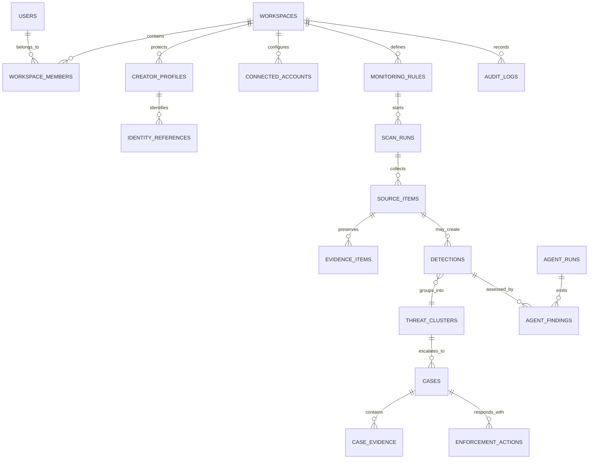

# Database Schema and Data Lifecycle

## Conventions

- PostgreSQL 16 is the source of truth. Prisma manages schema evolution; migrations are reviewed SQL artifacts.
- IDs are UUIDs generated by PostgreSQL. Timestamps use `timestamptz`, in UTC.
- Tenant data is scoped by `workspace_id`; repositories require scope and production uses PostgreSQL RLS policies based on a transaction-local workspace setting.
- Mutables include timestamps and an optimistic `version` field where review changes can collide. Evidence provenance and audit records are append-only.
- Large media and raw provider payloads live in object storage; PostgreSQL stores metadata, integrity hashes, object keys, and redacted summaries.

## Entity map

## Core tables

| Table | Key columns | Responsibility |
| --- | --- | --- |
| `users` | `id`, `clerk_user_id`, `email`, `status` | Local mapping for a Clerk principal; no passwords/credentials. |
| `workspaces` | `id`, `clerk_organization_id`, `name`, `plan`, `settings` | Creator or team tenant boundary. |
| `workspace_members` | `workspace_id`, `user_id`, `role`, `status` | Application roles: owner, admin, analyst, reviewer, viewer. |
| `creator_profiles` | `workspace_id`, `display_name`, `legal_name_encrypted`, `risk_preferences` | Protected creator identity and response preferences. |
| `identity_references` | `creator_profile_id`, `kind`, `value_normalized_hash`, `verification_status` | Handles, domains, aliases and asset references. Sensitive values are encrypted/hashed. |
| `connected_accounts` | `workspace_id`, `platform`, `external_account_id`, `secret_reference` | Authorized platform account; tokens live in secret manager. |
| `monitoring_rules` | `workspace_id`, `creator_profile_id`, `rule_type`, `config`, `schedule` | Versioned scan definitions and source/locale policy. |
| `scan_runs` | `workspace_id`, `monitoring_rule_id`, `status`, `idempotency_key` | One monitoring-rule execution with cost/error summary. |
| `source_items` | `workspace_id`, `platform`, `external_id`, `canonical_url`, `raw_payload_object_key` | Normalized external content reference. |
| `evidence_items` | `workspace_id`, `source_item_id`, `object_key`, `sha256`, `retention_until`, `legal_hold` | Immutable page/media/metadata capture and derivative relationship. |
| `threat_clusters` | `workspace_id`, `creator_profile_id`, `category`, `risk_score`, `status` | Groups related detections for investigation. |
| `detections` | `workspace_id`, `source_item_id`, `threat_cluster_id`, `category`, `confidence` | Evidence-backed suspected protection issue. |
| `cases` | `workspace_id`, `threat_cluster_id`, `status`, `priority`, `assigned_to` | Human response workflow. |
| `case_evidence` | `case_id`, `evidence_item_id`, `purpose` | Non-destructive case-to-evidence link. |
| `enforcement_actions` | `workspace_id`, `case_id`, `provider`, `action_type`, `status` | Human-approved reports, notices, takedowns, appeals. |
| `agent_runs` | `workspace_id`, `agent_type`, `model_version`, `input_fingerprint`, `cost_usd` | Reproducibility/cost record for every AI job. |
| `agent_findings` | `workspace_id`, `agent_run_id`, `detection_id`, `verdict`, `confidence`, `evidence_refs` | Structured agent conclusion; raw output is protected evidence. |
| `outbox_events` | `workspace_id`, `topic`, `aggregate_id`, `payload`, `published_at` | Durable domain-event handoff. |
| `job_runs` | `workspace_id`, `job_type`, `idempotency_key`, `status`, `trace_id` | Operational record for asynchronous work. |
| `notification_deliveries` | `workspace_id`, `channel`, `template`, `status` | Alert delivery/provider outcome. |
| `audit_logs` | `workspace_id`, `actor`, `action`, `resource`, `metadata` | Append-only security/operational audit trail. |

## Enum vocabulary

| Enum | Values |
| --- | --- |
| `WorkspaceRole` | `OWNER`, `ADMIN`, `ANALYST`, `REVIEWER`, `VIEWER` |
| `ThreatCategory` | `DEEPFAKE`, `IMPERSONATION`, `STOLEN_CONTENT`, `HARASSMENT`, `DOXXING`, `SCAM`, `OTHER` |
| `DetectionStatus` | `NEW`, `TRIAGED`, `CONFIRMED`, `DISMISSED`, `ESCALATED` |
| `CaseStatus` | `OPEN`, `IN_REVIEW`, `WAITING_EXTERNAL`, `RESOLVED`, `CLOSED` |
| `EnforcementStatus` | `DRAFT`, `PENDING_APPROVAL`, `SUBMITTED`, `ACKNOWLEDGED`, `ACTIONED`, `REJECTED`, `CANCELLED` |
| `JobStatus` | `QUEUED`, `RUNNING`, `SUCCEEDED`, `RETRYING`, `FAILED`, `CANCELLED`, `DEAD_LETTER` |
| `AgentReviewState` | `PENDING`, `ACCEPTED`, `REJECTED`, `OVERRIDDEN` |

## Prisma and PostgreSQL notes

`packages/database/prisma/schema.prisma` is the starting relational schema. Use `Json` only for extensible configuration, model metrics, redacted audit metadata, and provider summaries—not cross-tenant relationships, security decisions, or indexed product behavior.

Use reviewed SQL migrations for `pgcrypto`, `vector`, RLS, partial unique indexes, vector indexes, immutable audit triggers, and same-workspace association triggers; Prisma cannot fully express each PostgreSQL feature. Keep model/version and source hash alongside any embedding in a dedicated, access-scoped `content_embeddings` table.

## Index and retention policy

- Unique: Clerk user ID, non-null Clerk organization ID, membership pair, platform/external source pair, object key, and active job idempotency key.
- Index tenant tables on `(workspace_id, created_at DESC)`; review queues on `(workspace_id, status, updated_at DESC)`; use partial indexes for active monitoring and open cases.
- Evidence expires only when not on an open case or legal hold. A purge job creates an audit event, removes object versions per policy, and tombstones/restricts relational metadata as legally required.
- Workspace deletion is a workflow: revoke secrets, export authorized data, close webhooks, apply holds, purge artifacts, then retain the minimum audit record law/contract requires.
