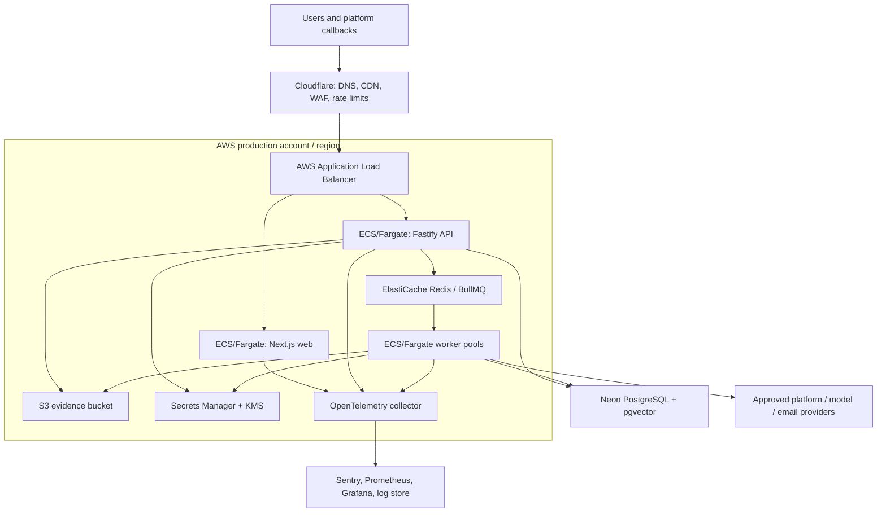

# Deployment and Infrastructure Architecture

## Reference production topology

The reference deployment uses Cloudflare at the edge, AWS for application workloads and private storage, Neon PostgreSQL for the initial managed database, and managed Redis. It is designed so individual vendors can be replaced without changing domain contracts.

## Network and account boundaries

- Use separate AWS accounts (or equivalent hard environments) for production, staging, security/log archive, and shared CI artifacts. Production has no developer standing access.
- Put web/API services behind the ALB. Worker pools, Redis, and observability collectors live in private subnets. Security groups allow only explicit workload flows.
- Use NAT/proxy egress with an allow-list for collectors and provider-specific worker pools. Block metadata endpoints and private/reserved address ranges from acquisition workers.
- S3 has block-public-access enabled, bucket-owner enforced, versioning, KMS encryption, lifecycle rules, CloudTrail data events, and restricted prefix-level IAM.
- Connect to Neon over TLS using a pooled connection endpoint. Prefer provider-supported private connectivity when the chosen Neon plan/region supports it; otherwise constrain egress, validate certificates, rotate credentials, and document the residual exposure. The database is never exposed through the public API.

## Compute model

| Workload              | Runtime                                                  | Scaling signal               | Network / permissions                                             |
| --------------------- | -------------------------------------------------------- | ---------------------------- | ----------------------------------------------------------------- |
| Web                   | Stateless ECS service                                    | requests, CPU/memory         | No direct database access; API-only credentials.                  |
| API                   | Stateless ECS service                                    | requests, p95 latency, CPU   | Database, Redis, secret reads; no unrestricted external crawling. |
| Outbox publisher      | API sidecar or dedicated small worker                    | unpublished outbox age       | Redis publish, database write/read.                               |
| Collection            | Isolated ECS worker pool                                 | queue depth, provider quota  | Restricted internet egress; no user session access.               |
| Evidence/media        | Isolated ECS worker pool; GPU capacity only if justified | queue depth, processing time | S3 scoped grants, scanning tools, restricted egress.              |
| Analysis              | Separate worker pool                                     | queue depth, model budget    | model gateway/provider access, limited evidence grants.           |
| Notification/response | Separate worker pool                                     | pending deliveries           | approved provider endpoints only.                                 |

Containers use immutable, content-addressed images from ECR, run as non-root, have defined CPU/memory limits, health checks, graceful shutdown, and no persistent local state. Compute is multi-AZ where the service/SLO needs it.

## Environment model

| Environment | Purpose                                          | Data policy                                | Promotion input                   |
| ----------- | ------------------------------------------------ | ------------------------------------------ | --------------------------------- |
| Local       | Developer feedback                               | Synthetic/local data and MinIO             | Developer machine only.           |
| Preview     | Per-change UI/API contract validation            | Sanitized fixtures; no production secrets  | Pull request artifact.            |
| Staging     | End-to-end, integration, load, release rehearsal | Synthetic or explicitly approved test data | Signed candidate image.           |
| Production  | Customer workload                                | Production data only                       | Approved release after all gates. |

Configuration is declarative and environment-specific. Secrets come from the runtime secret manager, not GitHub variables copied into images. Feature flags let Aegis use shadow/review-only analysis, percentage rollout, regional disablement, and immediate kill switches.

## Data resilience and disaster recovery

| Asset                 | Protection                                                                      | Initial objective                                                 |
| --------------------- | ------------------------------------------------------------------------------- | ----------------------------------------------------------------- |
| PostgreSQL            | Managed HA, point-in-time recovery, tested logical/export recovery              | RPO ≤ 15 minutes; RTO ≤ 4 hours.                                  |
| Evidence objects      | Versioned S3, lifecycle policy, replicated or restore-tested copy as required   | No loss of held evidence; recovery objective set by legal policy. |
| Redis queues          | Durable queue configuration plus authoritative job/outbox records in PostgreSQL | Rebuild/replay safely from durable records.                       |
| Configuration/secrets | Infrastructure-as-code and versioned secret metadata                            | Recreate environment without manual drift.                        |
| Observability         | Central retention and separate security archive                                 | Preserve incident-relevant audit/traces per policy.               |

Run restore drills at least quarterly. Backups alone do not satisfy the objective; the drill must demonstrate scoped application recovery, evidence integrity verification, and auditability.

## Release and rollback

1. CI builds a signed image and produces SBOM/provenance.
2. Deploy the immutable candidate to staging with a migration compatibility check.
3. Execute smoke, contract, integration, security, and selected evaluation gates.
4. Promote the same digest via canary/blue-green release. Observe error rate, latency, queue age, provider failures, and security signals.
5. Roll back application images immediately on regression. Database migrations follow expand–migrate–contract; a release never assumes a destructive instant rollback.

Infrastructure changes use reviewed IaC, plan review, policy checks, and drift detection. Production changes require an incident-safe rollback path and audit record.
