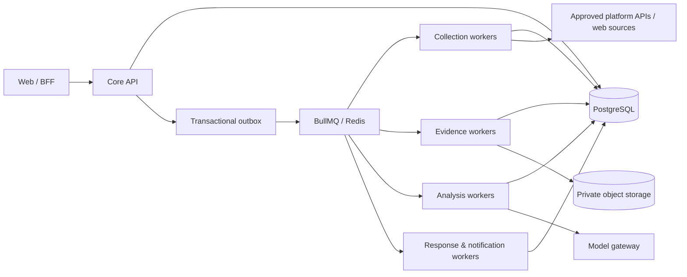

# Service Architecture and Evolution Plan

## Decision

Aegis ships first as a **modular monolith with independently deployed web, API, and worker workloads**. This is deliberately not a collection of network microservices on day one. It gives a small team transactional consistency, a single authorization model, and fast iteration while preserving hard seams for independent deployment.

`apps/api` owns synchronous commands and reads. `apps/worker` owns all collection, content processing, agent orchestration, and third-party delivery. The transactional outbox is the only supported way to initiate cross-workload work. No module may make a hidden direct call into another module's repository.

## Domain modules and ownership

| Module | Owns | Command examples | Reads from other modules through |
| --- | --- | --- | --- |
| Identity & Workspace | users, workspaces, memberships, policy capabilities | provision workspace, change member role | application authorization interface |
| Creator Identity | creator profiles, verified identity references, reference assets | add/verify identity reference | typed creator read model |
| Monitoring | rules, schedules, scan runs | activate rule, start scan | events and scoped query interface |
| Collection | connector configuration, source discovery | collect source candidates | connector contracts only |
| Evidence | evidence capture, hashes, retention/legal holds, signed access | preserve artifact, place legal hold | evidence manifest interface |
| Detection | findings, scoring, threat clusters | triage detection, recalculate cluster | versioned analysis events |
| Cases & Response | cases, evidence bundles, enforcement drafts/approvals | open case, approve action | case command interface |
| Notifications | preferences and delivery attempts | notify workspace | notification event contract |
| Analytics | derived metrics and reports | generate report | read-only event projections |
| Audit & Governance | audit trail, model registry metadata, policy versions | record privileged decision | append-only audit writer |

The database schema is physically shared in the first deployment, but each module owns its tables and migrations. A change to another module's tables requires that module owner's review. Cross-module views are read models, never a license to write another module's aggregates.

## Runtime topology

## Event backbone

The event envelope, versioned in `packages/contracts`, carries `eventId`, `type`, `workspaceId`, aggregate identity/version, correlation ID, timestamp, and schema-validated payload. It never carries raw credentials, raw media, or unrestricted PII; it refers to scoped database/object identifiers.

| Topic | Producer | Consumers | Idempotency key |
| --- | --- | --- | --- |
| `scan.requested.v1` | Monitoring | Collection | scan-run ID |
| `source.collected.v1` | Collection | Evidence, Detection | source-item ID + source revision |
| `evidence.captured.v1` | Evidence | Analysis | evidence ID + SHA-256 |
| `analysis.requested.v1` | Detection | Specialist agents | agent graph version + input fingerprint |
| `detection.created.v1` | Detection | Cases, Notifications, Analytics | detection ID |
| `case.opened.v1` | Cases | Notifications, Analytics | case ID |
| `enforcement.approved.v1` | Cases & Response | Response delivery | action ID + approved version |
| `notification.requested.v1` | Any domain module | Notifications | notification intent ID |

Consumers assume at-least-once delivery. A handler writes its result and processed-event/idempotency record in one transaction. Failed work is retried with bounded exponential backoff and ultimately enters a dead-letter queue with an operator workflow.

## Future extractable services

Do not extract merely because a module has a name. A module becomes a service only after an architecture review confirms at least one durable reason: independent scaling, a security/egress boundary, significantly different release cadence, clear data ownership, or a sustained operational bottleneck.

| Candidate service | Extract when | Boundary | Data ownership after extraction |
| --- | --- | --- | --- |
| Collection service | platform rate limits and connector fleet require independent scale/egress | source discovery events and connector API | connector state, source ingestion journal |
| Evidence service | browser sandboxing, malware processing, or storage throughput need isolation | capture requests and evidence manifests | capture manifests, artifact lifecycle metadata |
| Media analysis service | GPU/CPU workloads dominate or model privacy needs a separate trust zone | derivative inputs and signed internal artifact grants | analysis runs and model-output artifacts |
| Notification service | multi-channel delivery/retries grow independently | notification intent/result events | delivery attempts and preference projection |
| Analytics service | reporting harms OLTP performance | immutable events to warehouse | analytical projections only |
| Model gateway | provider routing/audit policy becomes shared across products | structured inference request/result API | provider registry, routing, spend ledger |

An extracted service receives its own deployable, data store/schema ownership, SLO, on-call owner, threat model, contract tests, and replay plan before it becomes production-critical. The core API must not synchronously depend on it for normal dashboard reads.

## Egress and trust zones

- Public web/API traffic terminates at the edge and application load balancer; the database, queue, and object store are never public application endpoints.
- Collector and browser-sandbox workers sit in a restricted egress zone. Their destination allow-list, DNS resolution, request size, and download type are controlled.
- Media-analysis workers receive only short-lived, scoped artifact grants; they do not get general object-store listing access.
- Response workers are the sole component permitted to call reporting or notification providers. An approval event is required before an external enforcement call.

## Architectural guardrails

- No direct database access from `apps/web`.
- No synchronous call to a third party on a normal user command path.
- No external enforcement from an agent or collection worker.
- No raw media, tokens, legal names, or full provider payloads in queue payloads or ordinary logs.
- No cross-workspace query without a workspace scope established before repository access.
- No breaking event changes: publish a new version and run both consumers during migration.
