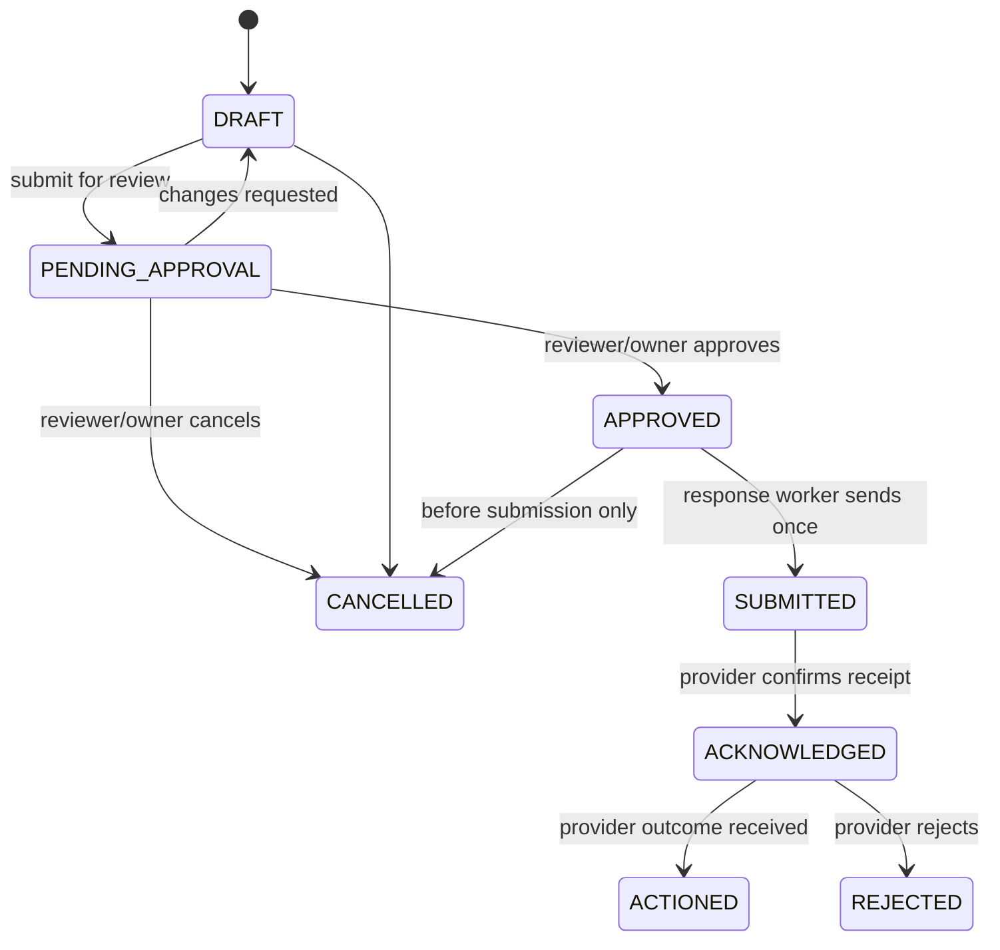

# Authorization and Permission System

## Authorization model

Authentication and organization membership come from Clerk. Aegis performs a second, application-level authorization check for every request: it resolves the active workspace, verifies an active membership, applies the role capability, and enforces resource ownership inside the database query.

The authorization decision is always server-side. A hidden UI button is not permission control. Every mutation writes an audit event containing the actor, action, resource, decision, correlation ID, and redacted reason.

## Roles

| Role | Intended user | Scope |
| --- | --- | --- |
| `OWNER` | Account owner / accountable executive | Full tenant control, billing, destructive lifecycle actions, policy delegation. |
| `ADMIN` | Trusted workspace administrator | Team, integrations, monitoring configuration, workspace controls; cannot transfer ownership. |
| `ANALYST` | Trust & safety operator | Investigate, triage, manage cases, prepare drafts; no final external approval. |
| `REVIEWER` | Senior approver / legal liaison | Review evidence and approve/cancel enforcement actions; no team or billing administration. |
| `VIEWER` | Read-only stakeholder | Read permitted dashboard, case, and report data; no sensitive-download or mutation rights by default. |

Roles are workspace-scoped. A user can hold different roles in different workspaces. Platform-wide support or incident access is a separate just-in-time, audited break-glass role, never a workspace membership shortcut.

## Capability matrix

| Capability | Owner | Admin | Analyst | Reviewer | Viewer |
| --- | ---: | ---: | ---: | ---: | ---: |
| View dashboard, detections, cases | Yes | Yes | Yes | Yes | Yes |
| Create/manage creator profiles and identities | Yes | Yes | Yes | No | No |
| Configure monitoring and connected accounts | Yes | Yes | No | No | No |
| Start/cancel allowed scan runs | Yes | Yes | Yes | No | No |
| View evidence metadata | Yes | Yes | Yes | Yes | Yes |
| Request an evidence access URL | Yes | Yes | Yes | Yes | No |
| Apply legal hold / change retention | Yes | Yes | No | No | No |
| Triage detections / create and manage cases | Yes | Yes | Yes | Yes | No |
| Create response or enforcement draft | Yes | Yes | Yes | Yes | No |
| Approve/cancel an external action | Yes | No | No | Yes | No |
| Submit approved action via connector | System only | System only | System only | System only | System only |
| Manage members and roles | Yes | Yes, except owner | No | No | No |
| Configure webhooks / API credentials | Yes | Yes | No | No | No |
| View audit logs | Yes | Yes | No | No | No |
| Delete workspace / transfer ownership | Yes | No | No | No | No |

“Yes” means the request is still subject to workspace scope, object state, and policy checks. For example, an approved action cannot be submitted twice, an archived workspace rejects mutations, and an evidence URL is denied when a legal/policy restriction applies.

## Sensitive operations

The following require step-up authentication, an explicit reason, or both:

| Operation | Additional control |
| --- | --- |
| Add/revoke a connected account | Step-up authentication; redact token details from audit logs. |
| Download or create signed access to protected evidence | Short-lived URL, purpose field, audit record, no bulk export by default. |
| Change legal hold, retention, or deletion state | Owner/Admin plus reason and dual review for enterprise policy. |
| Approve an enforcement action | Reviewer/Owner plus current case version and evidence completeness validation. |
| Invite admin/owner-equivalent member | Step-up authentication; owner transfer uses two-party confirmation. |
| Support break-glass access | Incident ticket, time-bound grant, session recording/audit, post-access review. |

## Enforcement state machine

The worker obtains permission to submit only from a durable `enforcement.approved.v1` event whose aggregate version matches the stored action. The API rejects an approval by a user who drafted the action when the workspace requires separation of duties.

## Database enforcement

- Every tenant-owned table has `workspace_id`; all repository entry points receive a mandatory workspace scope.
- PostgreSQL RLS is enabled in production. The connection sets a transaction-local workspace claim after API/worker authorization, and policies deny rows outside it.
- Worker service accounts use the narrowest database role needed; privileged maintenance operations use separate credentials and audited procedures.
- Service-to-service claims include workload identity, audience, workspace scope where applicable, and short expiry. They are not Clerk user tokens.

## Policy-as-data

Workspace policies control evidence access defaults, notification thresholds, scan limits, permitted connectors, approval requirements, and retention defaults. A policy version is stored on decisions and agent runs so historical outcomes remain explainable. Policy edits are versioned and audited; they do not silently rewrite historical decisions.
