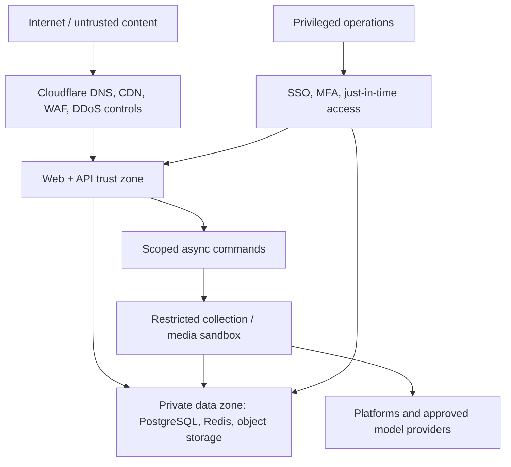

# Security and Privacy Architecture

## Security objectives

Aegis processes sensitive identity references, potentially biometric media, reputation signals, private account tokens, and legally relevant evidence. The platform is designed around zero-trust access, tenant isolation, evidence integrity, least privilege, and a human-controlled response boundary.

Security is a release requirement, not a later hardening phase. Every new connector, model provider, processing pipeline, or external action requires a lightweight threat model before implementation.

## Threat model

| Threat | Primary controls | Detection / recovery |
| --- | --- | --- |
| Cross-tenant data access | Server-side authorization, scoped repositories, PostgreSQL RLS, tenant tests | Audit alarms; revoke session/credentials; incident investigation. |
| Account takeover | Clerk MFA/passkeys, short sessions, step-up for sensitive actions, anomaly signals | Session revocation, access-log review, user notification. |
| Credential/token theft | Secret manager references, KMS envelope encryption, workload identity, redaction | Token revocation/re-auth; secret rotation runbook. |
| SSRF, malware, hostile media | Isolated fetchers, DNS/IP validation, egress allow-list, MIME/size limits, AV sandbox | Quarantine artifact; block indicator; patch/forensics. |
| Evidence tampering | SHA-256, capture manifest, object versioning, immutability/retention lock, append-only audit | Re-verify hash; preserve chain of custody; investigate access. |
| Prompt injection or unsafe agent output | Typed tools/output schemas, context scoping, policy gate, human approval | Mark run blocked; retain safe trace; rollback prompt/model. |
| Model/data exfiltration | Provider approval registry, data minimization, no-train/zero-retention terms where available, scoped artifact grants | Disable provider route; rotate keys; notify per obligations. |
| Queue replay/duplicate side effect | Idempotency keys, transactional outbox, version checks, provider idempotency | Dead-letter triage and safe replay. |
| DDoS/bot abuse | Cloudflare WAF/rate limits, API quotas, body limits, autoscaling | Edge/API alerts and traffic mitigation. |
| Supply-chain compromise | Locked dependencies, CI scanning, provenance, minimal images, patch SLAs | Block promotion; revoke artifact; rebuild from trusted source. |

## Trust boundaries

The sandbox cannot access production administrative endpoints, user sessions, or broad database credentials. It receives only the job input and short-lived capabilities necessary for a specific capture or analysis.

## Identity, access, and secrets

- Clerk manages end-user identity, sessions, MFA, and organization membership. Fastify verifies issuer, audience, signature, authorized party, expiry, and replay-sensitive claims before loading a membership.
- AWS workload identity (or equivalent) is used by deployments; long-lived cloud access keys are not injected into containers.
- OAuth refresh tokens, API keys, and provider secrets reside in a cloud secret manager. PostgreSQL stores a secret reference, never the token. If encrypted tenant secrets are unavoidable, use KMS-enveloped ciphertext with per-tenant data encryption keys.
- Secrets are never placed in browser bundles, OpenAPI examples, telemetry, test snapshots, exceptions, queue payloads, or audit metadata.
- Rotate provider secrets at least quarterly and immediately after suspected compromise. Connector revocation disables jobs before deletion.

## Data classification and handling

| Class | Examples | Storage / access rule |
| --- | --- | --- |
| Restricted | OAuth tokens, legal names, biometric source media, evidence under hold | Secret manager or private encrypted storage; least-privilege roles; no routine log access. |
| Confidential | detections, case notes, member emails, provider payloads | Tenant-scoped database/object storage; encrypted in transit/at rest; redacted telemetry. |
| Internal | aggregate health metrics, non-sensitive configuration | Authenticated internal systems; no public exposure. |
| Public | product documentation, deliberately published reports | Explicit publication approval; no inference from classification alone. |

Encryption in transit uses TLS 1.2+ with strict certificate validation. Encryption at rest uses managed database/storage encryption and KMS-managed keys. Production backups, replicas, and logs follow the same classification rules as primary data.

## Evidence chain of custody

1. Record the canonical source URL, normalized source ID, collector version, timestamp, and permitted acquisition method.
2. Store raw capture and derivatives in a private versioned bucket under a random key; calculate SHA-256 before admission.
3. Create an immutable capture manifest describing hash, MIME type, byte size, parent artifact, derivation tool/version, and trusted timestamp.
4. Log every access grant, export, legal hold, retention change, and action that cites the artifact.
5. Serve only short-lived, audience-bound signed URLs after authorization. Never expose a bucket key in client-visible data.
6. Purge only under the documented retention policy after checking legal hold and case status; record a tombstone/audit event.

## AI and provider governance

- The model registry records purpose, modalities, owner, provider, region, retention terms, data classification, benchmark, cost ceiling, and expiry.
- A model gateway applies routing, PII redaction/minimization, request quotas, structured-output validation, spend budgets, and provider outage fallbacks.
- AI output is treated as untrusted until it is schema-valid, evidence-linked, policy-allowed, and—where required—reviewed by a human. It cannot directly report, delete, ban, or publish.
- Prompts, tools, policies, thresholds, model versions, and reference asset versions are stored with an input fingerprint for reproducibility.
- Production rollout requires offline evaluation, adversarial/prompt-injection tests, false-positive analysis, privacy/legal review for sensitive modalities, shadow mode, and a kill switch.

## Application and infrastructure controls

- Validate all requests with runtime schemas; use parameterized database access and safe HTML rendering. Set CSP, HSTS, secure cookies, clickjacking protection, and strict CORS.
- Apply per-user, per-workspace, and per-IP rate limits; require idempotency keys for mutations; bound pagination and response sizes.
- Use private subnets/security groups for application data services. Put admin endpoints behind SSO/VPN or a dedicated admin plane.
- Run minimal, non-root, read-only-root-filesystem containers where feasible; sign images and scan before promotion.
- Centralize structured logs and OpenTelemetry traces with PII redaction. Audit logs are append-only and monitored for privileged actions.

## Privacy, legal, and safety operations

Product and counsel must set the supported jurisdictions, lawful bases, notice/consent rules, biometric-media requirements, retention schedule, and data-processing agreements before processing sensitive media at scale. The system supports these controls; it does not determine legal compliance automatically.

Required operational workflows: data subject request, workspace deletion, legal hold, law-enforcement request validation, vulnerability disclosure, security incident response, and model/provider incident response. Each has an owner, severity matrix, notification decision process, and exercised runbook before launch.
